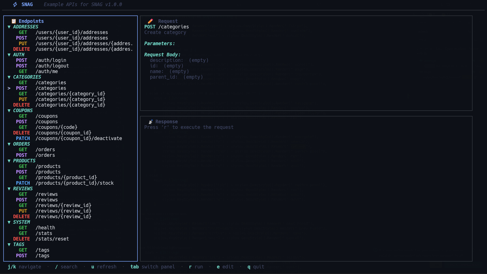
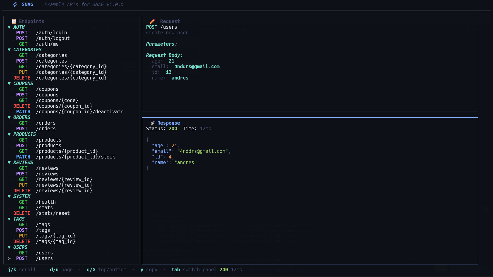
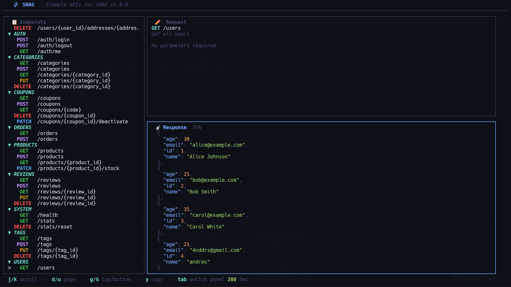
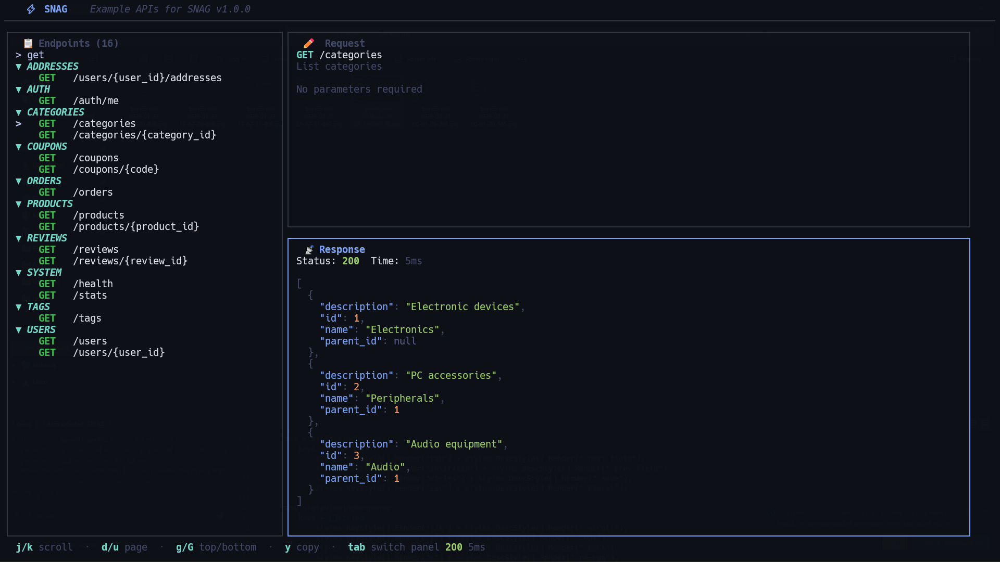

<div align="center">

# ⚡ SNAG

**S**wagger **N**avigator **A**nd **G**enerator

*Modern TUI client to explore and test REST APIs documented with OpenAPI 3.x / Swagger*

<br>

<table>
  <tr>
    <td></td>
    <td></td>
  </tr>
  <tr>
    <td></td>
    <td></td>
  </tr>
</table>

<br>

[](https://opensource.org/licenses/MIT)
[](https://go.dev/)
[](https://github.com/charmbracelet/bubbletea)

</div>

---

## 🌟 What is SNAG?

SNAG is an interactive API client that runs in your terminal. Think of it as Postman, but faster, minimalist, and with Vim-style keyboard shortcuts. It automatically consumes the OpenAPI specification of any API and allows you to navigate, edit parameters, and execute requests without leaving your terminal.

### Key Features

- **🎯 Automatic OpenAPI 3.x consumption**: Just provide the URL and SNAG discovers all endpoints
- **⌨️ Vim-style navigation**: `j/k` to move, `enter` to select, `esc` to go back
- **🎨 Elegant LazyVim-style interface**: Professional dark mode with syntax highlighting
- **📋 3 interactive real-time panels**:
  - **Navigation**: Endpoint list with smooth scrolling, grouped by tags with colors by HTTP method
  - **Editor**: Input field system for parameters and request body (no manual JSON editing!)
  - **Response**: Result with syntax highlighting, status code, and response time
- **🔍 Real-time search/filtering**: `/` key to search endpoints by method, path, or description
- **📊 Collapsible groups**: Organize endpoints by tags (Users, Products, Orders, etc.)
- **⚡ Fast and lightweight**: No heavy dependencies, written in Go with Bubble Tea
- **📋 Copy responses**: `y` key to copy JSON to clipboard
- **🌐 Compatible with any framework**: FastAPI, Express, Spring Boot, Django, Laravel, ASP.NET Core, etc.

## 🚀 Installation

### Via brew

```bash
brew install 4nddrs/tap/snag
```

## 📖 Basic Usage

```bash
# With any API that exposes OpenAPI 3.x
snag http://localhost:8000

# With the full path to openapi.json
snag http://localhost:8000/openapi.json

# With remote API
snag https://api.example.com

# With swagger.json (alias for openapi.json)
snag http://localhost:8000/swagger.json
```

### Examples with different frameworks

```bash
# FastAPI (Python)
snag http://localhost:8000

# Express.js con swagger-jsdoc (Node.js)
snag http://localhost:3000

# NestJS con @nestjs/swagger (Node.js)
snag http://localhost:3000

# Spring Boot con springdoc-openapi (Java)
snag http://localhost:8080

# Django con drf-spectacular (Python)
snag http://localhost:8000

# Laravel con l5-swagger (PHP)
snag http://localhost:8000

# ASP.NET Core con Swashbuckle (.NET)
snag http://localhost:5000

# Go con swaggo/swag
snag http://localhost:8080

# APIs públicas
snag https://api.stripe.com
snag https://api.github.com
```

## ⌨️ Keyboard Shortcuts

### Navigation Mode

- `j` / `↓` - Navigate down
- `k` / `↑` - Navigate up
- `enter` - Select endpoint
- `e` - Edit parameters/body with input fields
- `r` - Execute request
- `tab` - Switch focused panel
- `q` - Quit

### Parameter Edit Mode

- `tab` / `↓` - Next field
- `shift+tab` / `↑` - Previous field
- `ctrl+s` - Save and go back
- `esc` - Cancel and go back

### Response View Mode

- `j/k` - Scroll line by line
- `d` - Page down
- `u` - Page up
- `g` - Go to beginning
- `G` - Go to end
- `r` - Re-execute request
- `esc` - Go back to navigation

## 🛠️ Tech Stack

- **TUI Framework**: [Bubble Tea](https://github.com/charmbracelet/bubbletea) - Elm architecture for Go
- **Styles**: [Lip Gloss](https://github.com/charmbracelet/lipgloss) - Elegant layouts, borders and colors
- **Components**: [Bubbles](https://github.com/charmbracelet/bubbles) - Lists, textareas and viewports
- **HTTP Client**: Standard Go HTTP client
- **JSON Parsing**: Standard encoding/json

## 📁 Architecture

```
snag/
├── main.go      # Entry point, Bubble Tea loop (Init, Update, View)
├── model.go     # Data structures (Model, Endpoint, OpenAPISpec, etc.)
├── api.go       # API logic (fetch OpenAPI, parse endpoints, execute requests)
├── ui.go        # Lip Gloss styles and panel rendering
└── go.mod       # Dependencies
```

### Elm Pattern (Model-View-Update)

- **Model**: Complete application state
- **Init**: Initialization and OpenAPI spec loading
- **Update**: Event handling (keyboard, async messages)
- **View**: UI rendering with Lip Gloss

## 🎨 Tema de Colores (Dark Mode)

| Elemento            | Color                                                           | Hex       |
| ------------------- | --------------------------------------------------------------- | --------- |
| Primary (Navy Blue) |  | `#1E3A8A` |
| Secondary (Blue)    |  | `#3B82F6` |
| Success (Green)     |  | `#10B981` |
| Error (Red)        |  | `#EF4444` |
| Warning (Yellow)  |  | `#F59E0B` |
| Info (Cyan)         |  | `#06B6D4` |

### Métodos HTTP

- `GET` - Cyan (`#06B6D4`)
- `POST` - Green (`#10B981`)
- `PUT` - Yellow (`#F59E0B`)
- `DELETE` - Red (`#EF4444`)
- `PATCH` - Blue (`#3B82F6`)

## 🔮 Roadmap

- [ ] Syntax highlighting for JSON with Chroma
- [ ] Request history saving
- [ ] Environment variables and templates
- [ ] Authentication (Bearer, API Key, OAuth)
- [ ] Export requests to curl/code
- [ ] Multiple environments (dev, staging, prod)
- [ ] Automated endpoint testing

## 📝 Example with FastAPI

```python
# app.py
from fastapi import FastAPI

app = FastAPI(title="My API", version="1.0.0")

@app.get("/users")
def get_users():
    return [{"id": 1, "name": "John"}]

@app.post("/users")
def create_user(user: dict):
    return {"id": 2, **user}
```

```bash
# Run FastAPI
uvicorn app:app --reload

# In another terminal, run SNAG
snag http://localhost:8000
```

## 🤝 Contributing

Contributions are welcome. Please open an issue or PR.

## 📄 License

MIT

---

Made with ❤️ using [Bubble Tea](https://github.com/charmbracelet/bubbletea) and [Lip Gloss](https://github.com/charmbracelet/lipgloss)
